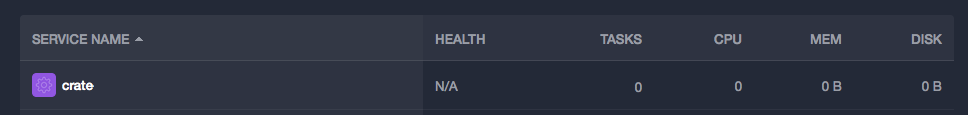
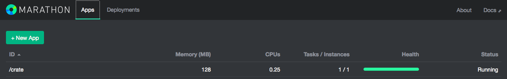
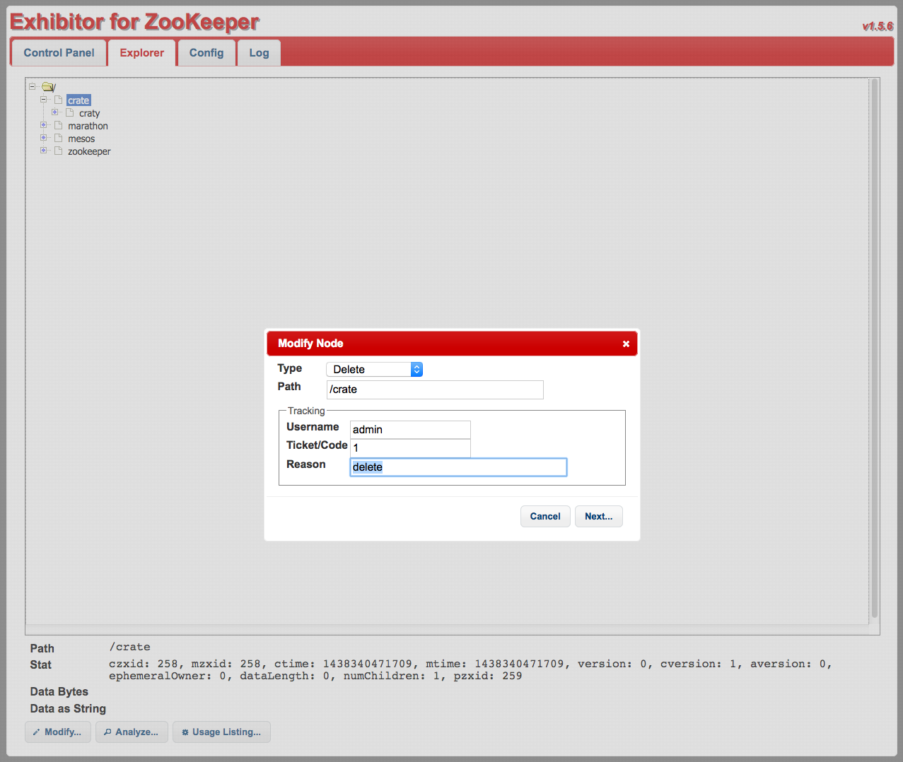

# Crate

**This tutorial has been published on [https://docs.mesosphere.com](https://docs.mesosphere.com/tutorials/crate/).**

**Disclaimer:** This service is available at the alpha level and not recommended for Mesosphere DCOS production systems.

Crate is a distributed NoSQL database which allows to query and compute data with SQL in real time by providing a distributed aggregation engine, native search and super simple scalability. Due to its shared-nothing-architecture Crate works well in distributed environments that allow horizontal scaling of applications.

## Table of Contents

* Installing Crate on DCOS
* Usage Examples
* Uninstalling Crate

## Installing Crate on DCOS

To install Crate using the DCOS CLI, enter this command:

    $ dcos package install crate
    
This will install the Crate service with a default Crate version configured and the default Crate cluster name is `crate`.

If you want to use a different Crate version with the service, you would need to override the default option using an options file:

    $ dcos package install crate --options=crate-options.json

where the `crate-options.json` will look like this:

    {
      "crate": {
        "version": "0.50.2"
      }
    }

There are three options to verify that Crate is successfully installed and running:

### 1\. Use the CLI:

    $ dcos package list
     NAME   VERSION  APP       COMMAND  DESCRIPTION
     crate  0.1.0    /crate    ---      A Mesos Framework that allows running and resizing one or multiple Crate database clusters.

### 2\. Use the DCOS web interface

The Crate service must be listed in the **Services** tab:

### 3\. Use the Marathon web interface

which is available at `<hostname>/service/marathon`:

## Usage Example

After installing, only a single task (the Crate service) is running on the DCOS cluster. To launch the Crate cluster you need to use the service API.

**Note, that you must have enough resources to add Crate instances!**

### Launching/Resizing the Cluster

The service API is exposed on the endpoint `<hostname>/service/<framework-name>/cluster`, where `framework-name` is default `crate`, e.g.:

    $ http://mydcosname.elb.amazonaws.com/service/crate/cluster

To launch instances, POST the number of desired instances to the `/resize` endpoint:

    $ curl -X POST http://mydcosname.elb.amazonaws.com/service/crate/cluster/resize \
          -H "Content-Type: application/json" \
          -d '{"instances": 3}'

### Shutting Down the Cluster

To shut down the cluster, POST to the `/shutdown` endpoint:

    $ curl -X POST http://mydcosname.elb.amazonaws.com/service/crate/cluster/shutdown

This will shut down all running Crate nodes of the cluster immediately.

### Installing Multiple Crate Clusters

A single instance of the Crate service can only run a single Crate cluster. However, it is possible to install Crate multiple times with different service names. Just use the ``crate.framework-name`` and ``crate.cluster-name`` options when installing Crate with the DCOS CLI:

    {
      "crate": {
        "framework-name": "crate-2",
        "cluster-name": "my-cluster"
        "framework": {
          "api-port": 4041
        }
      }
    }

**Note that the cluster name needs to be different when you are running multiple services!**

_Additionally the framwork API port needs to be set to a new unique and available port (default is 4040). This is not exposed but required to route the DCOS endpoints to the correct service instance._

Then run the install command with the DCOS CLI:

    $ dcos package install crate --options=crate-options.json

## Uninstalling Crate

### 1\. Uninstall Crate

Use the DCOS CLI:

    $ dcos package uninstall crate
    
If you have installed multiple Crate services you will need to provide the ``--app-id`` option, e.g.:

    $ dcos package uninstall crate --app-id /crate-2

### 2\. Remove data from Zookeeper

To delete data from Zookeeper you need to open the Exhibitor web interface at `<hostname>/exhibitor`, where `<hostname>` is the Mesos Master hostname.

Click on **Explorer** tab, select the desired app folder (``crate``) and click **Modify** at the bottom of the explorer.

Select **Delete** from the dropdown menu, provide the neccessary fields and click **Next**.

### 3\. Clear data directories

By default, Crate will write its data to the Mesos task sandbox, which means you don't need to clean any data.
However, if you want to use a persistent data path, you can set the data directory using the `crate.data-path` setting.
You can find more information about how to use custom, persistant data paths in the [framework documentation](https://github.com/crate/crate-mesos-framework#persistent-data-paths).

## Links

- [https://crate.io](https://crate.io)
- [Framework Documentation](https://github.com/crate/crate-mesos-framework/blob/master/README.rst)
- [Crate Documentation](https://crate.io/docs/en/stable/)

