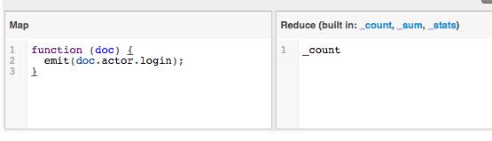

# Comparison Queries
##Crate

```sql
select actor['login'] as login, count(*) as count_login from ghevent group by actor['login'] order by count_login desc limit 10;
```

## MongoDB

```bash
mongoimport -d demodb -c ghevents --file 2015-06-10-0.json
```

```json
use demodb

db.ghevents.aggregate(
  { "$project" :
    { "actor.login" : 1 }
  },
  { "$group" :
    {_id : "$actor.login", total : { $sum : 1 }}
  },
  { $sort: { total: -1 } },
  { $limit : 10 }
)
```

## Cassandra

```sql
CREATE TYPE actor (
  id int,
  login text,
  gravatar_id text,
  url text,
  avatar_url text
);

CREATE TABLE ghevent (id int primary key, type text, actor frozen<actor>, public BOOLEAN, created_at TIMESTAMP);

INSERT INTO ghevent JSON '{"id":1234,"type":"CreateEvent","actor":{"id":665991,"login":"petroav","gravatar_id":"","url":"https://api.github.com/users/petroav","avatar_url":"https://avatars.githubusercontent.com/u/665991?"}}';


select count(actor.login) as count_login, actor.login as login from ghevent order by count_login;
```

## Riak
## Couchbase
_Import is hard_



## CockroachDB
## AranagoDB
